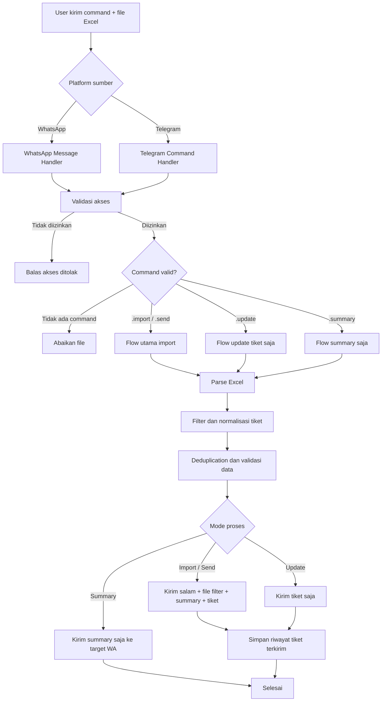
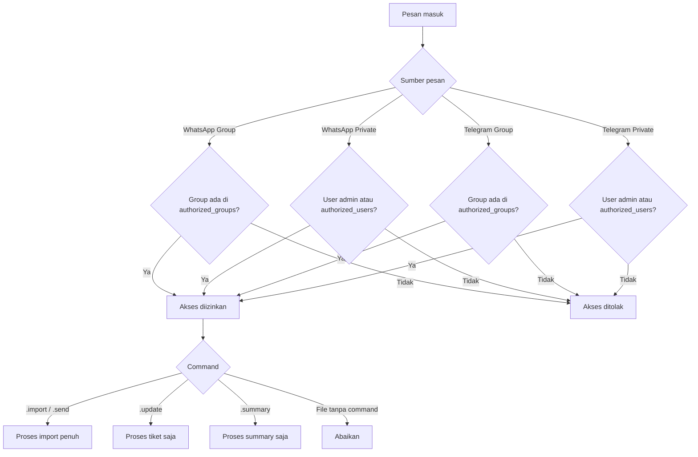
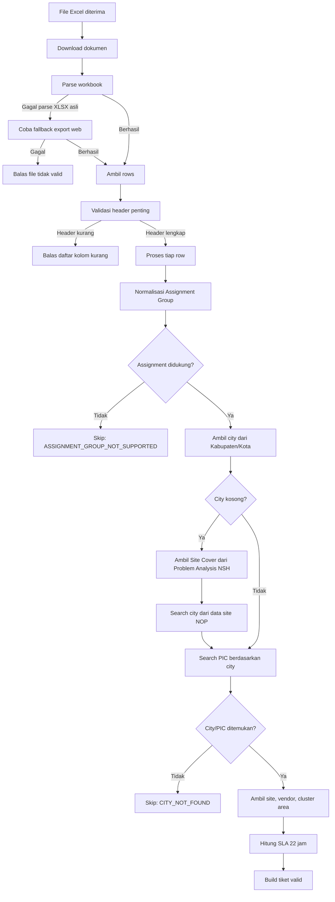
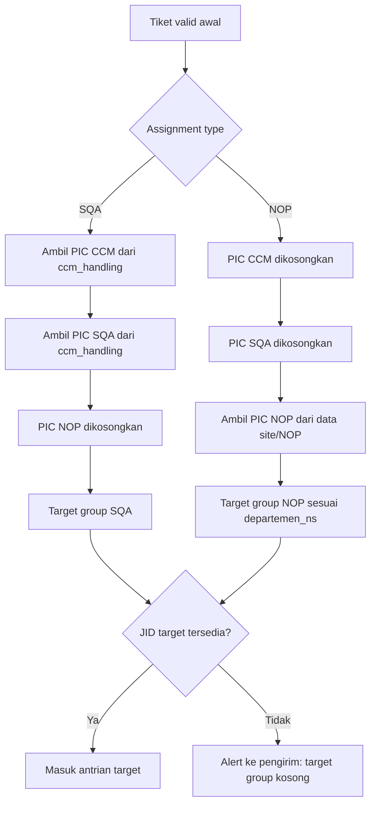
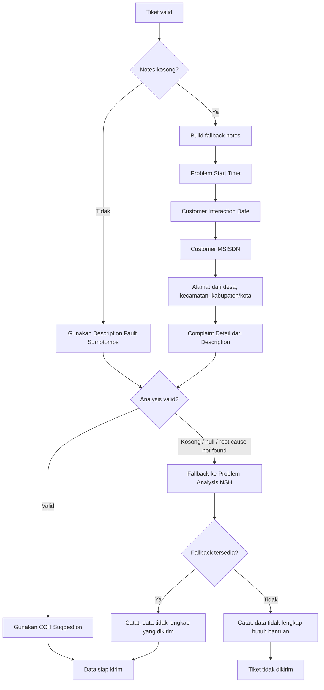
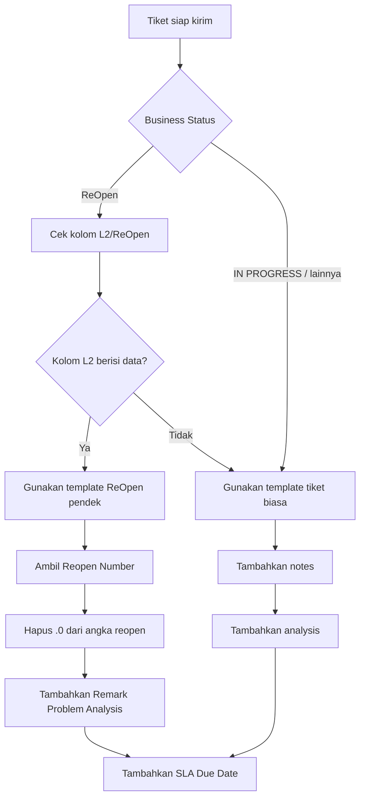
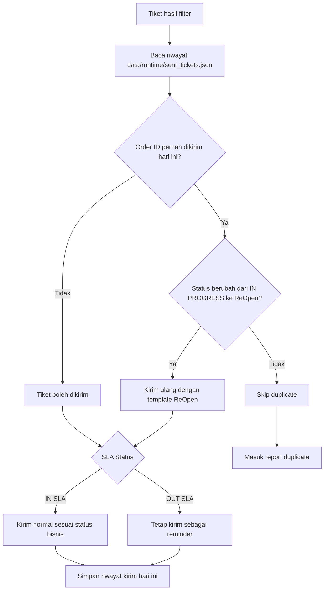
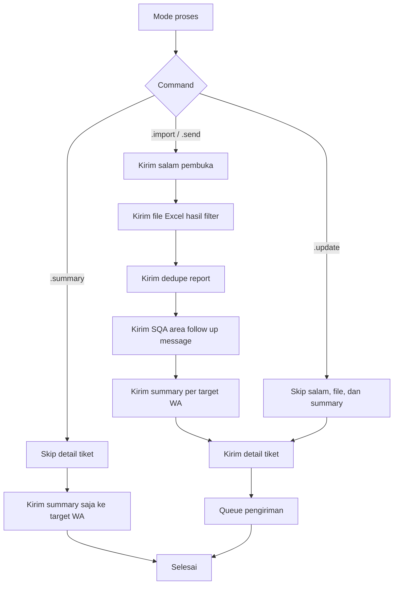
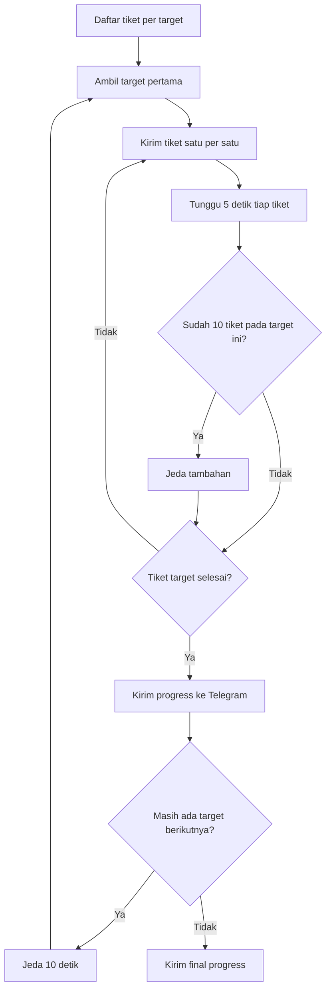

# Flowchart Send Tiket CCM

Dokumen ini berisi flowchart alur bot dari command masuk sampai tiket dikirim ke grup WhatsApp tujuan. Format diagram memakai Mermaid supaya bisa dirender langsung di GitHub, GitLab, VS Code extension Mermaid, atau mermaid.live.

## 1. Flow Utama



## 2. Validasi Akses



## 3. Parse dan Filter Excel



## 4. Resolusi PIC dan Target



## 5. Validasi Notes dan Analysis



## 6. Business Status dan Template Pesan



## 7. Deduplication



## 8. Mode Pengiriman



## 9. Queue dan Rate Limit



## 10. Environment Config

```mermaid
flowchart TD
  A[Bot butuh config WhatsApp] --> B{WHATSAPP_CONFIG_PATH diisi?}

  B -->|Ya| C[Gunakan path manual]
  C --> D[/change_env dikunci]

  B -->|Tidak| E[Baca data/runtime/app_runtime_env.json]
  E --> F{Environment aktif}

  F -->|production| G[config/whatsapp.json]
  F -->|development| H[config/whatsapp-test.json]
  F -->|Kosong| I[APP_ENV atau default production]

  I --> G
  G --> J[Load authorized_groups, authorized_users, target_groups, mentions]
  H --> J
```

## 11. Ringkasan Flowchart Singkat

```mermaid
flowchart LR
  A[Command + Excel] --> B[Access Check]
  B --> C[Parse Excel]
  C --> D[Filter Assignment]
  D --> E[Lookup City/Site/PIC]
  E --> F[SLA + Business Status]
  F --> G[Fallback Notes/Analysis]
  G --> H[Deduplicate]
  H --> I[Group by Target]
  I --> J[Send Summary/File/Ticket]
  J --> K[Save Sent History]
```


