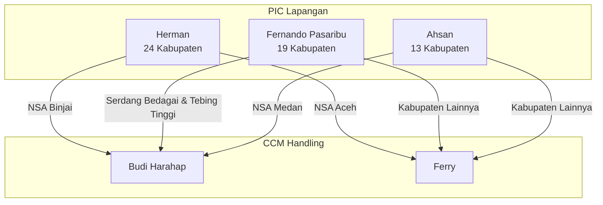
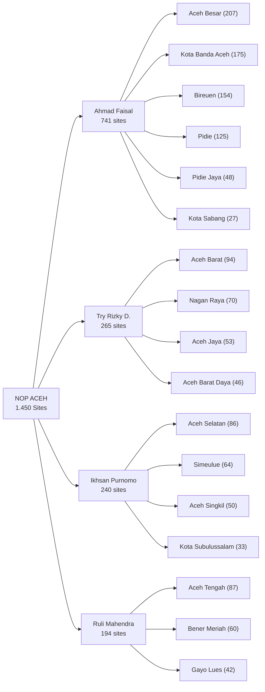
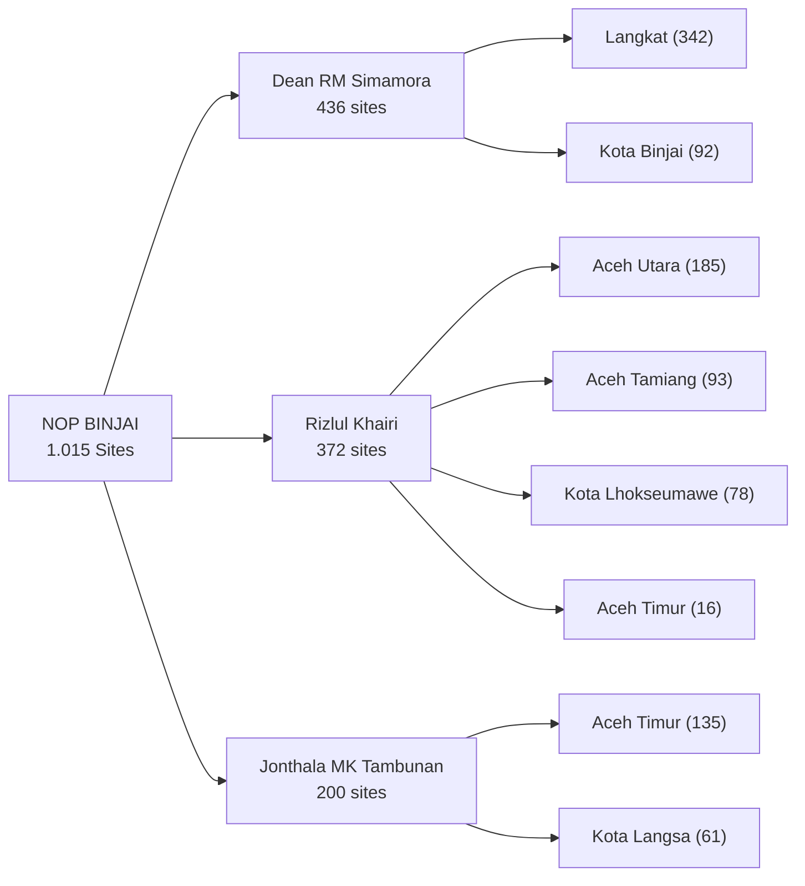
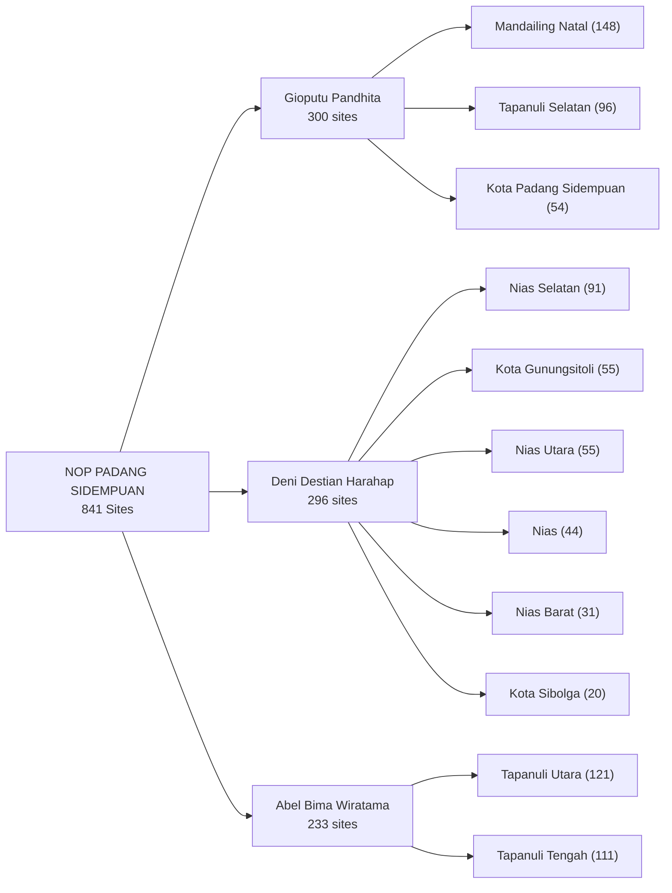
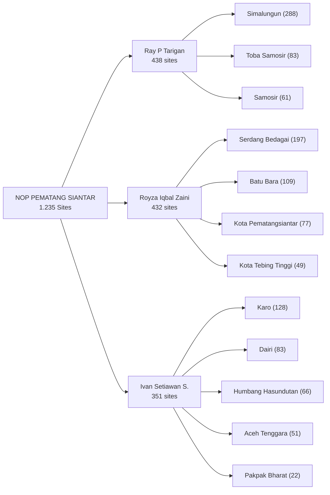
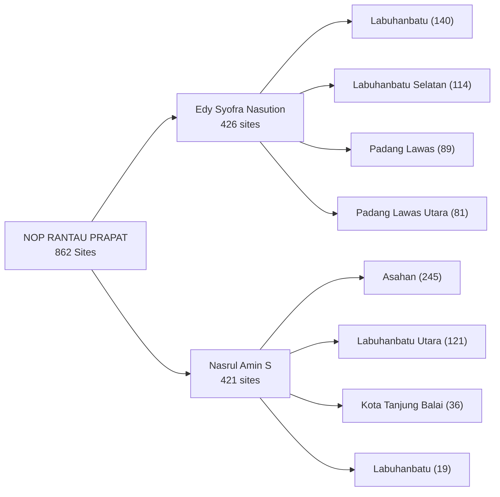

# Analisis & Pemetaan PIC SQA Regional Sumbagut

Dokumen ini menjelaskan struktur data, relasi, dan "benang merah" antara data detail site (**`pic_sqa_refernce.json`**) dengan data CCM Handling (**`ccm_handling_sqa_region_sumbagut.json`**).

---

## 📌 Pendahuluan
Dalam sistem pengelolaan tiket gangguan regional Sumbagut, terdapat dua tingkat tanggung jawab untuk tim **Service Quality Assurance (SQA)**:
1. **PIC SQA Lapangan (Field Engineer)**: Teknisi/insinyur yang bertanggung jawab langsung secara teknis di lapangan.
2. **CCM Handling (Coordinator)**: Koordinator tingkat regional yang mengelola penugasan tiket dan eskalasi.

---

## 🔍 Ringkasan Data & Perbandingan

| Parameter | Database NOP (`pic_nop_region_sumbagut.json`) | Referensi SQA (`pic_sqa_refernce.json`) |
| :--- | :---: | :---: |
| **Total Record (Site)** | 6.890 | 6.573 |
| **Site Irisan (Cocok)** | 6.562 | 6.562 |
| **Site Unik** | 328 *(Hanya di NOP)* | 11 *(Hanya di SQA)* |
| **Key/Kolom Unik** | `class`, `provinsi`, `region`, `total_cell`, `tower_heigh`, `tower_provider_name`, `type_bts_hotel`, `type_coverage`, `vendor` | `branch`, `district_operation_do`, `pic sqa` |

---

## 🧵 Benang Merah Relasi SQA Lapangan vs CCM Handling

Berdasarkan analisis data, ditemukan aturan pemetaan yang **100% konsisten** di mana **1 Kabupaten ditangani oleh tepat 1 orang PIC SQA Lapangan**. Hubungan eskalasi atau penugasan dari PIC Lapangan ke koordinator CCM adalah sebagai berikut:

---

## 📋 Detail Pembagian Wilayah Kerja (Kabupaten/Kota)

### 1. Wilayah Kerja: Herman (PIC Lapangan)
* **CCM Handling: Budi Harahap** (7 Kabupaten - Area NSA **Binjai**)
  * ACEH TAMIANG
  * ACEH TIMUR
  * ACEH UTARA
  * KOTA BINJAI
  * KOTA LANGSA
  * KOTA LHOKSEUMAWE
  * LANGKAT
* **CCM Handling: Ferry** (17 Kabupaten - Area NSA **Aceh**)
  * ACEH BARAT
  * ACEH BARAT DAYA
  * ACEH BESAR
  * ACEH JAYA
  * ACEH SELATAN
  * ACEH SINGKIL
  * ACEH TENGAH
  * BENER MERIAH
  * BIREUEN
  * GAYO LUES
  * KOTA BANDA ACEH
  * KOTA SABANG
  * KOTA SUBULUSSALAM
  * NAGAN RAYA
  * PIDIE
  * PIDIE JAYA
  * SIMEULUE

### 2. Wilayah Kerja: Fernando Pasaribu (PIC Lapangan)
* **CCM Handling: Budi Harahap** (2 Kabupaten - Area NSA **Pematangsiantar**)
  * SERDANG BEDAGAI
  * KOTA TEBING TINGGI
* **CCM Handling: Ferry** (17 Kabupaten - Area NSA **Pematangsiantar & Rantau Prapat**)
  * ASAHAN
  * BATU BARA
  * DAIRI
  * HUMBANG HASUNDUTAN
  * KARO
  * KOTA PEMATANGSIANTAR (termasuk KOTA PEMATANG SIANTAR)
  * KOTA TANJUNG BALAI
  * LABUHANBATU (termasuk LABUHAN BATU)
  * LABUHANBATU SELATAN (termasuk LABUHAN BATU SELATAN)
  * LABUHANBATU UTARA (termasuk LABUHAN BATU UTARA)
  * PADANG LAWAS
  * PADANG LAWAS UTBA (PADANG LAWAS UTARA)
  * PAKPAK BHARAT
  * SAMOSIR
  * SIMALUNGUN
  * TOBA SAMOSIR
  * ACEH TENGGARA

### 3. Wilayah Kerja: Ahsan (PIC Lapangan)
* **CCM Handling: Budi Harahap** (2 Kabupaten - Area NSA **Medan**)
  * DELI SERDANG
  * KOTA MEDAN
* **CCM Handling: Ferry** (11 Kabupaten - Area NSA **Padang Sidempuan**)
  * KOTA GUNUNGSITOLI (termasuk GUNUNGSITOLI)
  * KOTA PADANG SIDEMPUAN
  * KOTA SIBOLGA
  * MANDAILING NATAL
  * NIAS
  * NIAS BARAT
  * NIAS SELATAN
  * NIAS UTARA
  * TAPANULI SELATAN
  * TAPANULI TENGAH
  * TAPANULI UTARA

---

## 🛠️ Rekomendasi Integrasi pada Bot Tiket
Saat memproses tiket dari Excel:
1. Cari `site_id1(L1 Assign)` dari tiket di dalam database site.
2. Dapatkan nama **Kabupaten** dari site tersebut.
3. Gunakan tabel pemetaan di atas untuk menentukan **PIC Lapangan** (Ahsan/Fernando/Herman) dan **CCM Handling** (Ferry/Budi Harahap) secara otomatis dan konsisten.

---
---

# Analisis & Pemetaan PIC NOP Regional Sumbagut

Bagian ini menjelaskan pembagian wilayah kerja **PIC NOP (Network Operations and Productivity)** berdasarkan analisis data site di `pic_nop_region_sumbagut.json`.

---

## 📌 Pendahuluan NOP
Berbeda dengan SQA yang memiliki pemetaan **1 Kabupaten = 1 PIC**, pada NOP satu kabupaten **bisa dipegang oleh beberapa PIC** tergantung dari pembagian site. Namun, setiap **departemen NOP** memiliki PIC inti yang menangani mayoritas site.

Total PIC NOP di regional Sumbagut: **27 nama** (termasuk 10 PIC minor/cadangan yang menangani < 10 site).

> **Catatan**: Ditemukan duplikasi penulisan nama yang perlu diperhatikan:
> * `Edy Syofra Nasution` (426 sites) vs `Edy Sofra Nasution` (2 sites)
> * `Jonthala MK Tambunan` (202 sites) vs `Jonthala Mk.Tambunan` (1 site)
> * `Dean RM Simamora` (437 sites) vs `Dean Ruf Mampe Simamora` (2 sites)
> * `#N/A` (17 sites) — data PIC tidak terisi

---

## 🏢 Pembagian PIC per Departemen NOP

### 1. NOP ACEH (1.450 Sites)

| PIC (Utama) | Total Sites | Wilayah Kabupaten Utama |
| :--- | :---: | :--- |
| **Ahmad Faisal** | 741 | Aceh Besar, Bireuen, Kota Banda Aceh, Kota Sabang, Pidie, Pidie Jaya |
| **Try Rizky Darmawansyah** | 265 | Aceh Barat, Aceh Barat Daya, Aceh Jaya, Nagan Raya |
| **Ikhsan Purnomo** | 240 | Aceh Selatan, Aceh Singkil, Aceh Tengah, Kota Subulussalam, Simeulue |
| **Ruli Mahendra** | 194 | Aceh Tengah, Bener Meriah, Gayo Lues |

---

### 2. NOP BINJAI (1.015 Sites)

| PIC (Utama) | Total Sites | Wilayah Kabupaten Utama |
| :--- | :---: | :--- |
| **Dean RM Simamora** | 436 | Langkat, Kota Binjai |
| **Rizlul Khairi** | 372 | Aceh Utara, Aceh Tamiang, Kota Lhokseumawe |
| **Jonthala MK Tambunan** | 200 | Aceh Timur, Kota Langsa |

---

### 3. NOP MEDAN (1.499 Sites)

| PIC (Utama) | Total Sites | Wilayah Kabupaten Utama |
| :--- | :---: | :--- |
| **Adi Saputra Piliang** | 863 | Kota Medan (842), Deli Serdang (21) |
| **Rachmad S Siregar** | 588 | Deli Serdang (572), Kota Medan (16) |

> **Catatan**: NOP Medan hanya menangani 2 kabupaten (Kota Medan & Deli Serdang). Pembagiannya berbasis site — Adi Saputra Piliang dominan di Kota Medan, Rachmad S Siregar dominan di Deli Serdang. PIC minor/cadangan: `#N/A` (17), Fridollin Silalahi (10), Denny Ariansyah (10), Dhani Permana (4), Fernando Saragih (4).

---

### 4. NOP PADANG SIDEMPUAN (841 Sites)

| PIC (Utama) | Total Sites | Wilayah Kabupaten Utama |
| :--- | :---: | :--- |
| **Gioputu Pandhita** | 300 | Mandailing Natal (148), Tapanuli Selatan (96), Kota Padang Sidempuan (54) |
| **Deni Destian Harahap** | 296 | Nias Selatan (91), Kota Gunungsitoli (55), Nias Utara (55), Nias (44), Nias Barat (31), Kota Sibolga (20) |
| **Abel Bima Wiratama** | 233 | Tapanuli Utara (121), Tapanuli Tengah (111) |

---

### 5. NOP PEMATANG SIANTAR (1.235 Sites)

| PIC (Utama) | Total Sites | Wilayah Kabupaten Utama |
| :--- | :---: | :--- |
| **Ray P Tarigan** | 438 | Simalungun (288), Toba Samosir (83), Samosir (61) |
| **Royza Iqbal Zaini** | 432 | Serdang Bedagai (197), Batu Bara (109), Kota Pematangsiantar (77), Kota Tebing Tinggi (49) |
| **Ivan Setiawan Situmorang** | 351 | Karo (128), Dairi (83), Humbang Hasundutan (66), Aceh Tenggara (51), Pakpak Bharat (22) |

---

### 6. NOP RANTAU PRAPAT (862 Sites)

| PIC (Utama) | Total Sites | Wilayah Kabupaten Utama |
| :--- | :---: | :--- |
| **Edy Syofra Nasution** | 426 | Labuhanbatu (140), Labuhanbatu Selatan (114), Padang Lawas (89), Padang Lawas Utara (81) |
| **Nasrul Amin S** | 421 | Asahan (245), Labuhanbatu Utara (121), Kota Tanjung Balai (36), Labuhanbatu (19) |

---

## ⚠️ Perbedaan Penting: NOP vs SQA

| Aspek | SQA | NOP |
| :--- | :--- | :--- |
| **Pemetaan** | 1 Kabupaten = 1 PIC SQA | 1 Kabupaten bisa > 1 PIC NOP |
| **Jumlah PIC Utama** | 3 orang | 17 orang (6 departemen) |
| **Basis Penugasan** | Per Kabupaten | Per Site (site-level assignment) |
| **Pencarian PIC** | Cukup tahu kabupaten | Harus tahu `site_id` spesifik |
